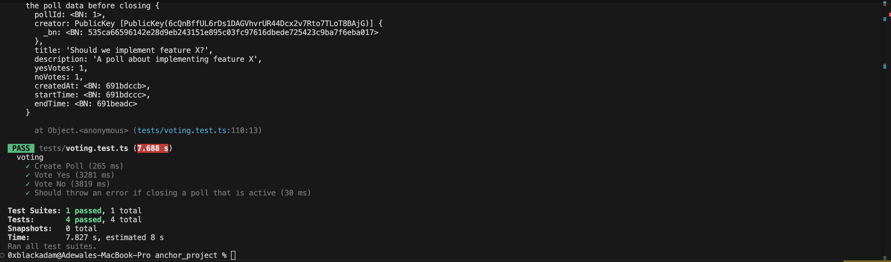

# Voting Program - Solana Anchor Project

A decentralized voting smart contract built with Anchor on Solana, enabling users to create time-based polls, and participate in voting with double-vote prevention and **NFT-gated voting** for exclusive community governance.

## Overview

This Anchor project implements a voting program that manages polls and voter participation on Solana. The program uses Program Derived Addresses (PDAs) to create deterministic, unique accounts for polls and voter records, ensuring efficient state management and preventing double voting.

### Key Features

✅ **Time-Based Polls** - Set custom start and end times for voting periods  
✅ **Double-Vote Prevention** - Blockchain-enforced unique voter tracking  
✅ **NFT-Gated Voting** - Restrict polls to holders of specific NFT collections  
✅ **Flexible Poll Types** - Support both public and NFT-restricted polls  
✅ **On-Chain Vote Counting** - Transparent, tamper-proof vote tallying

**Program ID (Devnet):** `2jP9HpT3ghFkPqYZbsPqdpmxhEFRJBkY4WzC8F56xpV9`

## Tech Stack

- **Anchor Framework 0.31.1** - Solana smart contract development
- **Anchor SPL 0.31.1** - Token program integration for NFT verification
- **Rust** - Smart contract language
- **Solana Web3** - Blockchain interaction
- **BN.js** - Big number handling

## Project Structure

```
anchor_project/
├── programs/
│   └── voting/
│       ├── src/
│       │   ├── lib.rs           # Main program entry
│       │   ├── instructions/    # Instruction handlers
│       │   │   ├── create_poll.rs
│       │   │   ├── vote.rs
│       │   │   └── mod.rs
│       │   └── state/          # Account state structures
│       │       ├── poll.rs
│       │       ├── voter.rs
│       │       └── mod.rs
│       ├── Cargo.toml
│       └── Xargo.toml
├── tests/
│   └── voting.test.ts          # Integration tests
├── target/                      # Build output
├── Anchor.toml                 # Anchor configuration
├── Cargo.toml                  # Workspace config
└── package.json
```

## Getting Started

### Prerequisites

- Rust 1.70+
- Solana CLI tools (latest)
- Anchor CLI (`npm install -g @coral-xyz/anchor`)
- Node.js 18+ and npm

### Installation

```bash
cd anchor_project
npm install
```

### Configuration

Anchor configuration is in `Anchor.toml`. Key settings:

```toml
[programs.devnet]
voting = "2jP9HpT3ghFkPqYZbsPqdpmxhEFRJBkY4WzC8F56xpV9"
```

## Building

Build the program:

```bash
anchor build
```

Output files:
- IDL: `target/idl/voting.json`
- Program: `target/deploy/voting.so`

## Testing

### Prerequisites for Testing

Start a local Solana validator:

```bash
solana-test-validator
```

### Run Tests

```bash
anchor test
```

Test file: `tests/voting.test.ts`

### Test Output



All tests pass successfully, validating:
- Poll creation with metadata storage
- Vote recording and counting
- Time-based access control
- Double-vote prevention
- Account state management

### Test Coverage

**Regular Voting Tests:**
- ✅ Create Poll - Successfully creates poll with metadata
- ✅ Vote Yes - User votes yes during active window
- ✅ Vote No - User votes no during active window
- ✅ Close Poll Error - Prevents closing active polls

**NFT-Gated Voting Tests:**
- ✅ Create NFT-Gated Poll - Successfully creates poll with NFT requirement
- ✅ Vote with Valid NFT - Allows voting when user owns the required NFT
- ✅ Reject Without NFT - Blocks users without sufficient NFT balance
- ✅ Reject Wrong Collection - Prevents voting with NFTs from wrong collection
- ✅ Prevent Double Voting - Ensures same user can't vote twice on NFT-gated polls

**Test Results:** All 9 tests pass successfully ✨

## Program Instructions

### 1. Create Poll

Initialize a new poll account (supports both public and NFT-gated polls).

**Parameters:**
- `poll_id` (u64) - Unique poll identifier
- `title` (String) - Poll title (max 200 chars)
- `description` (String) - Poll description (max 500 chars)
- `start_time` (i64) - Unix timestamp for voting start
- `end_time` (i64) - Unix timestamp for voting end
- `nft_collection` (Option<Pubkey>) - Optional NFT collection address for gated voting

**Constraints:**
- start_time must be in the future
- end_time must be after start_time
- Poll must not already exist

**Example Usage (Public Poll):**
```typescript
await program.methods
  .createPoll(
    pollId,
    "Should we adopt Solana?",
    "Vote on adopting Solana as our blockchain",
    Math.floor(Date.now() / 1000) + 3600,  // Start in 1 hour
    Math.floor(Date.now() / 1000) + 7200,  // End in 2 hours
    null  // No NFT requirement
  )
  .accounts({
    poll: pollPda,
    creator: publicKey,
    systemProgram: SystemProgram.programId
  })
  .rpc();
```

**Example Usage (NFT-Gated Poll):**
```typescript
await program.methods
  .createPoll(
    pollId,
    "NFT Holders: Which feature next?",
    "Exclusive poll for NFT collection holders",
    Math.floor(Date.now() / 1000) + 3600,
    Math.floor(Date.now() / 1000) + 7200,
    nftCollectionMint  // Require ownership of this NFT collection
  )
  .accounts({
    poll: pollPda,
    creator: publicKey,
    systemProgram: SystemProgram.programId
  })
  .rpc();
```

### 2. Vote

Cast a vote on an active **public** poll (non-NFT-gated).

**Parameters:**
- `poll_id` (u64) - Which poll to vote on
- `vote_type` (bool) - true for yes, false for no

**Constraints:**
- Current time must be within voting window
- Voter must not have already voted
- Poll must be public (not NFT-gated)
- Poll must exist

**Example Usage:**
```typescript
await program.methods
  .vote(pollId, true)  // Vote yes
  .accounts({
    poll: pollPda,
    voter: voterPda,
    voterSigner: publicKey,
    systemProgram: SystemProgram.programId
  })
  .rpc();
```

### 3. Vote with NFT

Cast a vote on an **NFT-gated** poll (requires NFT ownership).

**Parameters:**
- `poll_id` (u64) - Which poll to vote on
- `vote_type` (bool) - true for yes, false for no

**Constraints:**
- Current time must be within voting window
- Voter must not have already voted
- Voter must own at least 1 NFT from the required collection
- NFT token account must belong to the voter
- Poll must be NFT-gated

**Example Usage:**
```typescript
await program.methods
  .voteWithNft(pollId, true)  // Vote yes with NFT
  .accounts({
    poll: pollPda,
    voter: voterPda,
    voterSigner: publicKey,
    nftTokenAccount: userNftTokenAccount,  // User's NFT token account
    tokenProgram: TOKEN_PROGRAM_ID,
    systemProgram: SystemProgram.programId
  })
  .rpc();
```

**NFT Verification Process:**
1. Program checks the token account owner matches the voter
2. Verifies the token account has balance ≥ 1 (owns the NFT)
3. Validates the NFT mint matches the poll's required collection
4. Records the vote if all checks pass

### 4. Close Poll

Close a poll before it starts (poll creator only).

**Parameters:**
None (uses poll account from context)

**Constraints:**
- Must be called by poll creator
- Current time must be before poll start time

## Account Structures

### Poll Account

Stores poll metadata, vote counts, and NFT-gating configuration.

```rust
#[account]
pub struct Poll {
    pub poll_id: u64,               // Unique identifier
    pub creator: Pubkey,            // Creator wallet
    pub title: String,              // Poll title (max 200 chars)
    pub description: String,        // Poll description (max 500 chars)
    pub yes_votes: u32,             // Yes vote count
    pub no_votes: u32,              // No vote count
    pub created_at: i64,            // Creation timestamp
    pub start_time: i64,            // Voting start time
    pub end_time: i64,              // Voting end time
    pub is_nft_gated: bool,         // Whether NFT ownership is required
    pub nft_collection: Option<Pubkey>, // Required NFT collection (if gated)
}
```

**PDA Seeds:** `["poll", poll_id]`
**Space:** ~1000 bytes (varies by title/description length)

### Voter Account

Tracks whether a user has voted on a poll.

```rust
#[account]
pub struct Voter {
    pub poll_id: u64,           // Which poll
    pub has_voted: bool,        // Vote status
}
```

**PDA Seeds:** `["voter", poll_id, voter_pubkey]`
**Space:** 64 bytes

## PDA Derivation

The frontend can derive account addresses without querying the blockchain:

```typescript
// Poll PDA
const [pollPda] = PublicKey.findProgramAddressSync(
  [
    Buffer.from("poll"),
    new BN(pollId).toBuffer("le", 8)
  ],
  VOTING_PROGRAM_ID
);

// Voter PDA
const [voterPda] = PublicKey.findProgramAddressSync(
  [
    Buffer.from("voter"),
    new BN(pollId).toBuffer("le", 8),
    userWallet.toBuffer()
  ],
  VOTING_PROGRAM_ID
);
```

## Deployment

### Deploy to Devnet

```bash
anchor deploy --provider.cluster devnet
```

### Verify Deployment

```bash
solana program show 2jP9HpT3ghFkPqYZbsPqdpmxhEFRJBkY4WzC8F56xpV9 --url devnet
```

## Debugging

### View Program Logs

```bash
solana logs 2jP9HpT3ghFkPqYZbsPqdpmxhEFRJBkY4WzC8F56xpV9 --url devnet
```

### Inspect Account

```bash
solana account <ACCOUNT_ADDRESS> --url devnet
```

### View Transactions

```bash
solana confirm -v <TX_SIGNATURE> --url devnet
```

## Security Considerations

1. **Time-based Access Control**: Uses `Clock::get()` to enforce voting windows
2. **Double-vote Prevention**: Voter PDAs with `has_voted` flag prevent multiple votes
3. **NFT Ownership Verification**: Token account ownership and balance checks ensure valid NFT holders
4. **Collection Validation**: Verifies NFT mint matches required collection address
5. **PDA Authority**: Ensures only program can modify accounts
6. **Input Validation**: All parameters validated before state changes
7. **Constraint-based Security**: Anchor constraints prevent unauthorized account access

## NFT-Gated Voting Architecture

### How It Works

1. **Poll Creation**: Creator specifies optional `nft_collection` address
2. **Vote Instruction Selection**: 
   - Public polls use `vote()` instruction
   - NFT-gated polls use `vote_with_nft()` instruction
3. **NFT Verification**: Program validates:
   - Token account owner matches voter
   - Token balance ≥ 1 (owns the NFT)
   - NFT mint matches poll's required collection
4. **Vote Recording**: If valid, vote is counted and voter marked as voted

### Error Codes

- `AlreadyVoted` (6000) - Voter has already voted on this poll
- `Unauthorized` (6001) - Not authorized to close this poll
- `InvalidPollTime` (6002) - Invalid poll time settings
- `PollMismatch` (6003) - Poll ID mismatch
- `VotingNotActive` (6004) - Voting is not currently active
- `PollNotStarted` (6005) - Poll has not started yet
- `PollEnded` (6006) - Poll has already ended
- `PollAlreadyStarted` (6007) - Poll has started, can only be closed by admin
- `InvalidNftOwner` (6009) - NFT token account owner does not match voter
- `InsufficientNftBalance` (6010) - Insufficient NFT balance (at least 1 required)
- `InvalidNftCollection` (6011) - NFT does not belong to required collection
- `NftGatedPoll` (6012) - Must use `vote_with_nft` for NFT-gated polls
- `PollNotNftGated` (6013) - This poll is not NFT-gated

## Development Workflow

1. **Make changes** to program code in `programs/voting/src/`
2. **Build locally** with `anchor build`
3. **Run tests** with `anchor test`
4. **Deploy** with `anchor deploy`
5. **Verify** in frontend integration

## Useful Commands

```bash
anchor build              # Build program
anchor test              # Run tests
anchor deploy            # Deploy to configured cluster
anchor idl fetch PROGRAM_ID  # Fetch IDL from on-chain
anchor idl upgrade PROGRAM_ID  # Update IDL
```
## Resources

- [Anchor Documentation](https://docs.rs/anchor-lang/)
- [Solana Program Architecture](https://docs.solana.com/developing/programming-model/calling-between-programs)
- [PDA Documentation](https://docs.solana.com/developing/programming-model/calling-between-programs#program-derived-addresses)

## Contributing

See the root repository [README.md](../README.md) for contribution guidelines.

## License

This project is built by 0xblackadam for Ackee Blockchain Security Bootcamp.
